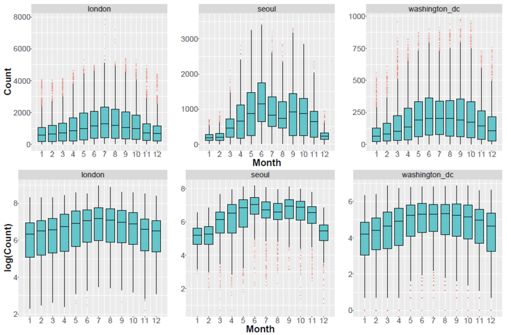

```{r setup, include=FALSE}
library(knitr)
library(tidyverse)
library(pracma)
library(data.table)
library(dplyr)
library(tidyr)
library(magrittr)
library(ggplot2)
library(ggpubr)
library(GGally)
library(faux)
library(janitor)
library(glmnet)
library(MASS)
library(caret)
library(RColorBrewer)
library(car)

set.seed(5)

knitr::opts_chunk$set(echo = FALSE, warning=FALSE, message=FALSE)
```

# Introduction

For our project, we analyzed various datasets related to bike sharing data from different geographical locations (e.g. Seoul, Washington D.C., London etc) containing information about the number of bikes rented on different days, along with weather conditions (temperature, humidity, etc) and miscellaneous information about the day these bikes were rented (weekends, holidays, etc).

## Research question

The question we wish to answer using these datasets, is what various variables/factors can be used to predict the number of bikes that will be rented on a given day.

We also want to test the following hypotheses (since the test procedure for the hypotheses are similar, ie nonparametric bootstrap F-test, we will only be testing a few main ones):

-   Is $\beta_{temp}$ different in different locations? We expect people in different areas to have different temperature preferences.
-   Are any of the betas insignificant when tested as a group? We will test this after model selection
-   Does the number of bike users follow any "common" distribution? We expect the ols model to be a poor fit, and that it follows a discrete probability distribution

Our findings could help inform bike sharing companies into making better economic decisions in regards to improving marketing decisions, scheduling, and conducting maintenance.

## Primary focus

Our primary focus is causal inference. We aim to figure out what are the factors most likely to affect the count of bike users. We will use nonparametric bootstrap F-tests to achieve this goal.

## Data Overview

We are using the following datasets (each bullet-point is a hyperlink) for data exploration and modeling:

-   [Bike Sharing in Washington D.C. Dataset (2011-2012)](https://www.kaggle.com/datasets/marklvl/bike-sharing-dataset)
-   [Seoul Bike Sharing Demand Data Set (2017-2018)](https://archive.ics.uci.edu/ml/datasets/Seoul+Bike+Sharing+Demand#)
-   [London bike sharing dataset (2015-2017)](https://www.kaggle.com/datasets/hmavrodiev/london-bike-sharing-dataset)

Each dataset contains the hourly count of rental bikes on each specific date, with additional information on weather and holiday schedules. Each observation corresponds to an hour of the day.

## Modeling Introduction
We will be utilizing model selection techniques (CV, AIC/BIC) and shrinkage methods (LASSO) to improve our model fit. We will also be testing various GLM fits (motivations for this listed below) and will be using bootstrapped F-testing to answer the research questions listed above.

We will be modeling our data using either a negative binomial, poisson distribution or log-normal distribution.

The OLS model is not a good fit for our data because in our EDA, since we observed heteroscedasticity. In particular, it appears that the variance of count in each month increases as mean increases. Furthermore, our project deals with count–based data, while OLS predictions are typically continuous. Therefore, we believe that it might be more appropriate to use a negative binomial or poisson distribution to model our data. We will also test log-normal distributions because it is possible that the transformed data might be normal, and the variance of log(cnt) are fairly homoscedastic. 

We will compare all the models by studying the RMSE and log-likelihood of the fitted models.

# Modeling Tool Assumptions


## Assumptions for Distributions

### OLS/log-OLS Assumptions

- Homoscedastic normal random errors
- Response variable is linear with respect to our data
- Continuous response variable
- We observe that variance of log-normal model is quite similar across months (figure above)

### Poisson Assumptions

- Modeling count data (response variable is non-negative integers)
- Conditioning on all the covariates, the response variable (count in our project) should have equal mean and variance. ^[We note that this hypothesis is hard to test in our project. Due to the presence of continuous variables (temp, hum, windspeed), when we group the rows by all covariates, we find that none or almost none of the rows have the exact same values for all covariates. We cannot construct a distribution using only one (or very few) data point(s)].
- There is a linear relationship between the covariates and log(count).

### Negative Binomial Assumptions

- Similar assumptions to a poisson model, since the poisson distribution is just a special case of the negative binomial distribution
- Does not make the assumption that the variance of the response variable is equal to the mean, but rather that the variance is proportional to the mean in addition to the inclusion of a dispersion parameter. This more general model might give us a better fit to our data.

### Shared Assumptions
For all models, we must ensure the assumption of independence of rows, or independence of different observations, which motivates our decision to treat “hour” as categorical data to remove the row dependence associated with time series data.

## Assumptions for model selection and shrinkage methods
### AIC/BIC assumptions
AIC and BIC are selection criterias based on the likelihood of the models, therefore the underlying assumption is that our data does indeed follow the probability distribution used in our model. The difference between AIC and BIC is that BIC penalizes the number of parameters more heavily than AIC, hence it will result in a more parsimonious model.

### CV/LASSO
CV does not assume anything of our data, and is the most flexible approach, and is an approach meant to minimize the error metric that we define (in this case, the MSE). Lasso also does not assume much about our data and also aims to minimize the MSE, but with an added L1 regularization term on our parameters. Both CV and LASSO cannot tell us anything about the likelihood of our model being correct. 

### Assumptions of bootstrap and F-tests
In employing the nonparametric bootstrap F-test, we do not make any assumption about the distribution of the population data, but we assume that our data is representative of the population data. This could be a reasonable assumption as our sample size (>43k) is relatively large.

# Testing GLMs

Shown below is the data that we are using for our analysis. Our data consists of 43,553 rows.

```{r loading data}
df_full = read.csv('combined_dataset_cleaned.csv', colClasses= c("integer", "character", "logical", "character", "numeric", "numeric", "numeric", "integer", "integer", "integer", "integer", "integer", "character", "integer", "logical", "logical"))
df = df_full[c("cnt", "temp", "hum", "windspeed", "location", "hr", "is_workday", "season")]
df$hr = as.character(df$hr)
kable(head(df), caption = "Preview of data used")
```

We first test the various models with cross-validation to observe the errors.

```{r CV Model training}
num_folds = 10
seeds = 1:(num_folds + 1)
train_control <- trainControl(method="cv", number=num_folds, seeds=seeds)
train_control_nb <- caret::trainControl(
	method = "cv", 
	number=10, 
	seeds = list(rep(1, 3), 
				 rep(2, 3), 
				 rep(3, 3), 
				 rep(4, 3), 
				 rep(5, 3),
				 rep(6, 3),
				 rep(7, 3),
				 rep(8, 3),
				 rep(9, 3),
				 rep(10, 3),
				 11))

ols_simple_train <- train(cnt ~ ., data=df, method="lm", trControl=train_control)
ols_complex_train = train(
  cnt ~ . + temp*location*season + temp*hr*is_workday,
  data=df, 
  method="lm", 
  trControl=train_control
)

log_ols_simple_train <- train(log(1+cnt) ~ ., data=df, method="lm", trControl=train_control)
log_ols_complex_train = train(
  log(1+cnt) ~ . + temp*location*season + temp*hr*is_workday,
  data=df, 
  method="lm", 
  trControl=train_control
)

poisson_simple_train = train(
  cnt ~ ., 
  data=df, 
  method="glm", 
  family="poisson", 
  trControl=train_control
)
poisson_complex_train = train(
  cnt ~ . + temp*location*season + temp*hr*is_workday,
  data=df, 
  method="glm", 
  family="poisson", 
  trControl=train_control
)

nbm_simple_train = train(cnt ~ ., data=df, method="glm.nb", trControl=train_control_nb)
nbm_complex_train = train(
  cnt ~ . + temp*location*season + temp*hr*is_workday, 
  data=df, 
  method="glm.nb", 
  trControl=train_control_nb
)
```

```{r}
summary_train_df = data.frame(
  model = c(
    "ols_simple", 
    "ols_complex", 
    "log_ols_simple", 
    "log_ols_complex", 
    "poisson_simple", 
    "poisson_complex",
    "nbm_simple",
    "nbm_complex"
    ),
  rmse = c(
    ols_simple_train$results$RMSE,
    ols_complex_train$results$RMSE,
    sqrt(mean((exp(predict(log_ols_simple_train, newdata=df)) - 1 - df$cnt)^2)),
    sqrt(mean((exp(predict(log_ols_complex_train, newdata=df)) - 1 - df$cnt)^2)),
    poisson_simple_train$results$RMSE,
    poisson_complex_train$results$RMSE,
    nbm_simple_train$results$RMSE[2],
    nbm_complex_train$results$RMSE[2]
  ),
  mae = c(
    ols_simple_train$results$MAE,
    ols_complex_train$results$MAE,
    mean(abs((exp(predict(log_ols_simple_train, newdata=df)) - 1 - df$cnt))),
    mean(abs((exp(predict(log_ols_complex_train, newdata=df)) - 1 - df$cnt))),
    poisson_simple_train$results$MAE,
    poisson_complex_train$results$MAE,
    nbm_simple_train$results$MAE[2],
    nbm_complex_train$results$MAE[2]
  ),
  rSquared = c(
    ols_simple_train$results$Rsquared,
    ols_complex_train$results$Rsquared,
    log_ols_simple_train$results$Rsquared,
    log_ols_complex_train$results$Rsquared,
    poisson_simple_train$results$Rsquared,
    poisson_complex_train$results$Rsquared,
    nbm_simple_train$results$Rsquared[2],
    nbm_complex_train$results$Rsquared[2]
  )
)

kable(summary_train_df, caption="CV Train Results")
```

We observe that the models with the triple interaction terms perform better (on RMSE) than the simpler models. This follows our expectations from our EDA where we see different trends when we conditioned on these triple interaction terms. We also see that the RMSE of the poisson model is better than the negative binomial model, which is interesting. This will be explored in the following section.

We train on full data in the following section.

```{r Comparing full models}
ols_simple = lm(cnt ~ ., data=df)
ols_complex = lm(cnt ~ . + temp*location*season + temp*hr*is_workday, data=df)
 
log_ols_simple = lm(log(1+cnt) ~ ., data=df)
log_ols_complex = lm(log(1+cnt) ~ . + temp*location*season + temp*hr*is_workday, data=df)

poisson_simple = glm(cnt ~ ., data = df, family = "poisson")
poisson_complex = glm(cnt ~ . + temp*location*season + temp*hr*is_workday, data = df, family = "poisson")

nbm_simple = glm.nb(cnt ~ ., data = df, link="log")
nbm_complex = glm.nb(cnt ~ . + temp*location*season + temp*hr*is_workday, data = df, link="log")
```

```{r}
models = c(
  "ols_simple", 
  "ols_complex", 
  "log_ols_simple", 
  "log_ols_complex", 
  "poisson_simple", 
  "poisson_complex",
  "nbm_simple",
  "nbm_complex"
)

rmses = c(
  sqrt(mean((ols_simple$fitted.values - df$cnt)^2)),
  sqrt(mean((ols_complex$fitted.values - df$cnt)^2)),
  sqrt(mean(((exp(log_ols_simple$fitted.values) - 1) - df$cnt)^2)),
  sqrt(mean(((exp(log_ols_complex$fitted.values) - 1) - df$cnt)^2)),
  sqrt(mean((poisson_simple$fitted.values - df$cnt)^2)),
  sqrt(mean((poisson_complex$fitted.values - df$cnt)^2)),
  sqrt(mean((nbm_simple$fitted.values - df$cnt)^2)),
  sqrt(mean((nbm_complex$fitted.values - df$cnt)^2))
)

maes = c(
  mean(abs(ols_simple$residuals)),
  mean(abs(ols_complex$residuals)),
  mean(abs(((exp(log_ols_simple$fitted.values) - 1) - df$cnt))),
  mean(abs(((exp(log_ols_complex$fitted.values) - 1) - df$cnt))),
  mean(abs((poisson_simple$fitted.values - df$cnt))),
  mean(abs((poisson_complex$fitted.values - df$cnt))),
  mean(abs((nbm_simple$fitted.values - df$cnt))),
  mean(abs((nbm_complex$fitted.values - df$cnt)))
)

loglikelihoods = c(
  logLik(ols_simple),
  logLik(ols_complex),
  logLik(log_ols_simple),
  logLik(log_ols_complex),
  logLik(poisson_simple),
  logLik(poisson_complex),
  logLik(nbm_simple),
  logLik(nbm_complex)
)

summary_df = data.frame(
  model = models, rmse = rmses, mae = maes, loglikelihood = loglikelihoods
)
kable(summary_df, caption="Full Data Train Results")
```


Again, we see that when training on full data, the RMSE (and log-likelihood) of the complex models are better than that of the simpler models. An interesting observation is that even though the RMSE of the poisson models are better than the equivalent negative binomial models, they have much worse log-likelihoods, approx 10x worse. Due to the extremely poor log-likelihood of the poisson model, we will not be using it for further analysis, although we will still investigate the fit of this model.

The best performing model based on log-likelihood is the log-ols model, by a significant margin. It also has the best RMSE and MAE of the models excluding the poisson models. This provides us justification for choosing this over the other models in our further analysis. The following plots show us the relationship between predicted values and residuals. We observe that residuals are not evenly scattered about 0.

```{r}
myPalette = colorRampPalette(rev(brewer.pal(11, "RdYlGn")))

generate_df = function(model) {
  output_df = data.frame(preds=model$fitted.values, residuals=model$fitted.values - df$cnt)
  return(output_df)
}

generate_plot = function(model, title) {
  resids_df = generate_df(model)
  plot = ggplot(data=resids_df, aes(x=preds, y=residuals, colour=df$cnt)) + 
    geom_point(size=0.3, alpha=0.8) +
    ggtitle(title) +
    scale_colour_gradientn(colours = myPalette(100)) +
    theme(plot.title = element_text(hjust = 0.5, size=10))
  return(plot)
}

generate_df_log_models = function(model) {
  preds = predict(model, newdata=df)
  resids = exp(preds) - 1 - df$cnt
  output_df = data.frame(preds=exp(preds) - 1, residuals=resids)
  return(output_df)
}

generate_plot_log_models = function(model, title) {
  resids_df = generate_df_log_models(model)
  plot = ggplot(data=resids_df, aes(x=preds, y=residuals, colour=df$cnt)) + 
    geom_point(size=0.3, alpha=0.8) +
    ggtitle(title) +
    scale_colour_gradientn(colours = myPalette(100)) +
    theme(plot.title = element_text(hjust = 0.5, size=10))
  return(plot)
}

ggarrange(
  generate_plot(ols_simple, "ols_simple"),
  generate_plot_log_models(log_ols_simple, "log_ols_simple"),
  generate_plot(poisson_simple, "poisson_simple"),
  generate_plot(nbm_simple, "nbm_simple"),
  generate_plot(ols_complex, "ols_complex"),
  generate_plot_log_models(log_ols_complex, "log_ols_complex"),
  generate_plot(poisson_complex, "poisson_complex"),
  generate_plot(nbm_complex, "nbm_complex"),
  nrow=2,
  ncol=4,
  common.legend = TRUE
)
```

Here's a closer look at the log-ols model, with the fit against $cnt$ and $log(1+cnt)$ respectively. We observe that besides a group of errors when $cnt$ is extremely low (seen by the negative downwards sloping lines), the log-ols model has a good fit against $log(cnt+1)$. We see that when $cnt$ is extremely low, our model frequently overpredicts the actual value. Our residuals are evenly scattered around the x-axis for our log-normal model, with slight heteroskedasticity.

```{r}
generate_df_log_models_logcnt = function(model) {
  preds = predict(model, newdata=df)
  output_df = data.frame(preds=preds, residuals=model$residuals)
  return(output_df)
}

generate_plot_log_models_logcnt = function(model, title) {
  resids_df = generate_df_log_models_logcnt(model)
  plot = ggplot(data=resids_df, aes(x=preds, y=residuals, colour=df$cnt)) + 
    geom_point(size=0.3, alpha=0.8) +
    ggtitle(title) +
    scale_colour_gradientn(colours = myPalette(100)) +
    theme(plot.title = element_text(hjust = 0.5, size=10))
  return(plot)
}
ggarrange(
  plot_log_complex_cnt = generate_plot_log_models(log_ols_complex, "log_ols_complex_cnt"),
  plot_log_simple_cnt = generate_plot_log_models(log_ols_simple, "log_ols_simple_cnt"),
  plot_log_complex_logcnt = generate_plot_log_models_logcnt(log_ols_complex, "log_ols_complex_logcnt"),
  plot_log_simple_logcnt = generate_plot_log_models_logcnt(log_ols_simple, "log_ols_complex_logcnt"),
  nrow=2,
  ncol=2,
  common.legend = TRUE
)


```

# Model Selection

In the following, we apply both AIC and BIC model selection (both backwards and forwards) to select for a sparser set of variables from the log-ols model. We expect BIC to give us a sparser model because the penalty term of BIC scales with the number of parameters in the model, but AIC does not. Note that both AIC and BIC require a likelihood distribution of our coefficient vector, $\beta$, hence the methods we are currently applying are valid only if our assumption that our data follows a log normal distribution is true.

```{r, echo=FALSE, results='hide', message=FALSE}
full.model = lm(log(cnt + 1) ~ . + temp*location*season + temp*hr*is_workday, data = df)

bic_step_forward.model = stepAIC(
  full.model, 
  direction = "forward",
  k = log(nrow(df)),
  trace = TRUE
)
aic_step_forward.model = stepAIC(
  full.model, 
  direction = "forward",
  trace = TRUE
)

bic_step_backward.model = stepAIC(
  full.model, 
  direction = "backward",
  k = log(nrow(df)),
  trace = TRUE
)
aic_step_backward.model = stepAIC(
  full.model, 
  direction = "backward",
  trace = TRUE
)

bic_step_both.model = stepAIC(
  full.model, 
  direction = "both",
  k = log(nrow(df)),
  trace = TRUE
)
aic_step_both.model = stepAIC(
  full.model, 
  direction = "both",
  trace = TRUE
)
```
```{r}
num_coeffs_df = data.frame(
  model = c("full", 
            "bic_forward", 
            "aic_forward", 
            "bic_backward", 
            "aic_backward", 
            "bic_bidirectional", 
            "aic_bidirectional"),
  num_coeff = c(
    size(full.model$coefficients)[2],
    size(bic_step_forward.model$coefficients)[2],
    size(aic_step_forward.model$coefficients)[2],
    size(bic_step_backward.model$coefficients)[2],
    size(aic_step_backward.model$coefficients)[2],
    size(bic_step_both.model$coefficients)[2],
    size(aic_step_both.model$coefficients)[2]
  )
)
kable(num_coeffs_df, caption="Number of coefficients after selection")

generate_errors = function(model) {
  preds = exp(predict(model, df)) - 1
  actuals = df$cnt
  return(data.frame(rmse=sqrt(mean((preds - actuals)^2)), mae=mean(abs(preds - actuals))))
}

full_errors = generate_errors(full.model)
reduced_model_errors = generate_errors(aic_step_both.model)

kable(data.frame(
  model=c("full", "reduced"), 
  rmse=c(full_errors$rmse, reduced_model_errors$rmse),
  mae=c(full_errors$mae, reduced_model_errors$mae)
  ),
  caption="Errors of models")
```

Forward selection does not shrink the model at all, while backwards and bidirectional selection shrinks both the AIC and BIC model by the same 23 parameters. The parameters removed are:

```{r}
all_coeff_names = names(full.model$coefficients)
bic_coeff_names_both = names(bic_step_both.model$coefficients)
aic_coeff_names_both = names(aic_step_both.model$coefficients)
setdiff(all_coeff_names, bic_coeff_names_both)
```
The selection criteria means that the triple interaction term of $temp*hr*isWorkday$ is removed. The resulting model is:

```{r}
summary(bic_step_both.model)
```

Most of our covariates have very significant coefficients, but we note that the following covariates do not have significant p-values. We will run a F-test to determine if they are significant as a group. 

```{r}
pvals = summary(bic_step_both.model)$coefficients[, 4]
pvals = pvals[pvals >= 0.1]
kable(data.frame(pvals), caption="Insignificant Coefficients")
```


We also test variable selection with LASSO. Choosing $\lambda_{1\sigma}$, we find that lasso shrinks the model by the following 48 variables.

```{r}
X = model.matrix(full.model)
y = log(1 + df$cnt)
cv_model = cv.glmnet(X, y, alpha=1, standardize = TRUE)
lasso_1se_model = glmnet(x=X, y=y, lambda = cv_model$lambda.1se, standardize = TRUE)
zeroed_variables = c()
for (x in 1:120) {
  if (lasso_1se_model$beta[x] == 0) {
    zeroed_variables = c(zeroed_variables, x)
  }
}
row.names(lasso_1se_model$beta)[zeroed_variables]
```
However, this model shrinkage does not result in an easily understood model, and as seen below, the errors are significantly worse than the errors of the models selected by AIC/BIC. We will therefore not use this model.

```{r}
preds = predict(lasso_1se_model, newx=X)
actuals = y
resids = preds - actuals
rmse = sqrt(mean((exp(preds) - 1 - actuals)^2))
mae = mean(abs(exp(preds) - 1 - actuals))

kable(data.frame(rmse=rmse, mae=mae), caption="Errors of LASSO 1se model")
```


## Bootstrap F-test

Due to heteroskedasticity in our data, we will be employing the bootstrap F-test to answer our research questions.

```{r}
getFStat <- function(model, X, L, c) {
    X = as.matrix(X)
    ## NOTE 1: beta_naut must be only the values 
    ##        of the params of interest for the hypothesis test.
    ## NOTE 2: X must be (IN THE PROPER ORDER) the 
    ##        numeric columns of the regression 
    ##        (that you made in part (b), for instance)
    
    mod_summary <- summary(model)
    
    hat_beta <- mod_summary$coefficients[,1] %>% as.matrix(ncol=1)
    
    F_num <- 1/nrow(L) * t(L %*% hat_beta - c) %*% 
        solve(L %*% solve(t(X) %*% X) %*% t(L)) %*% 
        (L %*% hat_beta - c)
    
    F_denom <- sum(residuals(model)^2) / (nrow(X) - nrow(hat_beta)) 
    
    return(F_num / F_denom)
}
```

```{r}
get_p_value_from_bootstrap = function(model, L, c, B=1000) {
  X = model.matrix(model)
  n = nrow(df)
  coefficients = names(model$coefficients)
  log_cnt = log(df$cnt + 1)
  X_plus_log_cnt = cbind(X, log_cnt = log_cnt)
  estimated_c = L %*% summary(model)$coefficients[,1] %>% as.matrix(ncol=1)
  f_score_to_test = getFStat(model, X, L, c)
  vect_of_bootstrapped_f_scores <- rep(0, B)
  for (i in 1:B) {
    set.seed(i)
    random_rows = sample(1:n, n, replace=TRUE)
    X_plus_log_cnt_random_sample = X_plus_log_cnt[random_rows, ]
    lm_bootstrap = lm(log_cnt ~ ., data=as.data.frame(X_plus_log_cnt_random_sample))
    X_random_sample = subset(X_plus_log_cnt_random_sample, select=-(log_cnt)) # Remove log_cnt
    bootstrapped_f = getFStat(lm_bootstrap, X_random_sample, L, estimated_c)
    vect_of_bootstrapped_f_scores[i] = bootstrapped_f
  }
  get_p_value_from_bootstrap = sum(vect_of_bootstrapped_f_scores > f_score_to_test[1]) / B
}
```

### Question 1: Is $\beta_{temp}$ different in different locations? We expect people in different areas to have different temperature preferences.
To test this hypothesis, we want to test whether the betas for temp:locationseoul and temp:locationwashington_dc are 0.

```{r}
# Get the indices of temp:locationseoul and temp:locationwashington_dc
coefficients = names(bic_step_both.model$coefficients)
idx_temp_seoul = which(coefficients == "temp:locationseoul") #34
idx_temp_wash = which(coefficients == "temp:locationwashington_dc") #35

L_temp_location = matrix(0, nrow=2, ncol=97)
L_temp_location[1, idx_temp_seoul] = 1
L_temp_location[2, idx_temp_wash] = 1

p_value_temp_location = get_p_value_from_bootstrap(bic_step_both.model, L_temp_location, matrix(c(0, 0), ncol=1))
disp(paste("P value of F-test temp:locationseoul = temp:locationwashington_dc = 0:", as.character(p_value_temp_location)))
```

Since the p value from bootstrap is 0, we see that the interaction term $temp*location$ is significant, proving that our hypothesis was right.

### Question 2: Are the betas from our model that had low p-values insignificant when tested as a group?
``` {r}
# Get the indices of the insignificant coefficients listed previously
coefficients = names(bic_step_both.model$coefficients)
idx_hr21 = which(coefficients == "hr21") # 20
idx_hr22 = which(coefficients == "hr22") # 21
idx_summer = which(coefficients == "seasonsummer") #32
idx_temp_wash = which(coefficients == "temp:locationwashington_dc") #35
idx_temp_summer = which(coefficients == "temp:seasonsummer") #37
idx_temp_winter = which(coefficients == "temp:seasonwinter") #38
idx_temp_hr18 = which(coefficients == "temp:hr18") #54
idx_temp_hr23 = which(coefficients == "temp:hr23") #60
indices = c(idx_hr21, idx_hr22, idx_summer, idx_temp_wash, idx_temp_summer, idx_temp_winter, idx_temp_hr18, idx_temp_hr23)

L_insig_coeffs = matrix(0, nrow=8, ncol=97)
for (i in 1:8) {
  L_insig_coeffs[i, indices[i]] = 1
}
p_value_insig_coeffs = get_p_value_from_bootstrap(bic_step_both.model, L_insig_coeffs, matrix(rep(0, 8), ncol=1))
disp(paste("P value of F-test all insignficant betas = 0:", as.character(p_value_insig_coeffs)))
```

Seeing that the p value from bootstrap is 0, we can also conclude that the the beta values $\beta_{hr21}$, $\beta_{hr22}$, $\beta_{seasonsummer}$, $\beta_{temp:locationwashington_dc}$, $\beta_{temp:seasonsummer}$, $\beta_{temp:seasonwinter}$, $\beta_{temp:hr18}$, $\beta_{temp:hr23}$ are significant as a group and reject the null hypothesis that all these coefficients are actually 0.

# Conclusion
It is not surprising that the negative binomial distribution is a better fit than the ols model, but it is somewhat surprising that our data follows the log normal distribution more closely than both the poisson and negative binomial distributions. However, this is still reasonable since the log normal model also always gives us non-negative values, unlike the ols model.

One mode of errors observed in the log-ols model is that when the actual values are extremely low, but the model still predicts high values. We could possibly address this issue by implementing a 2 stage model, the first stage being a logistic regression to determine whether the actual output should be below some threshold value, and the second stage being the models we tested. We did preliminary testing of this approach, and found that logistic regression works poorly, and more sophisticated methods might be required.

In regards to our research questions, we were able to conclude that our hypothesis that $\beta_{temp}$ is different in different locations, at least for the fall season by using a nonparametric bootstrap f-test to determine that the interaction terms $\beta_{temp:locationseoul}$ and $\beta_{temp:locationwashingtonDC}$ are not 0. We also were able to conclude with a nonparametric bootstrap f-test that the covariates found to be insignificant in the model selected by BIC bidirectional selection are actually in fact significant as a group.
